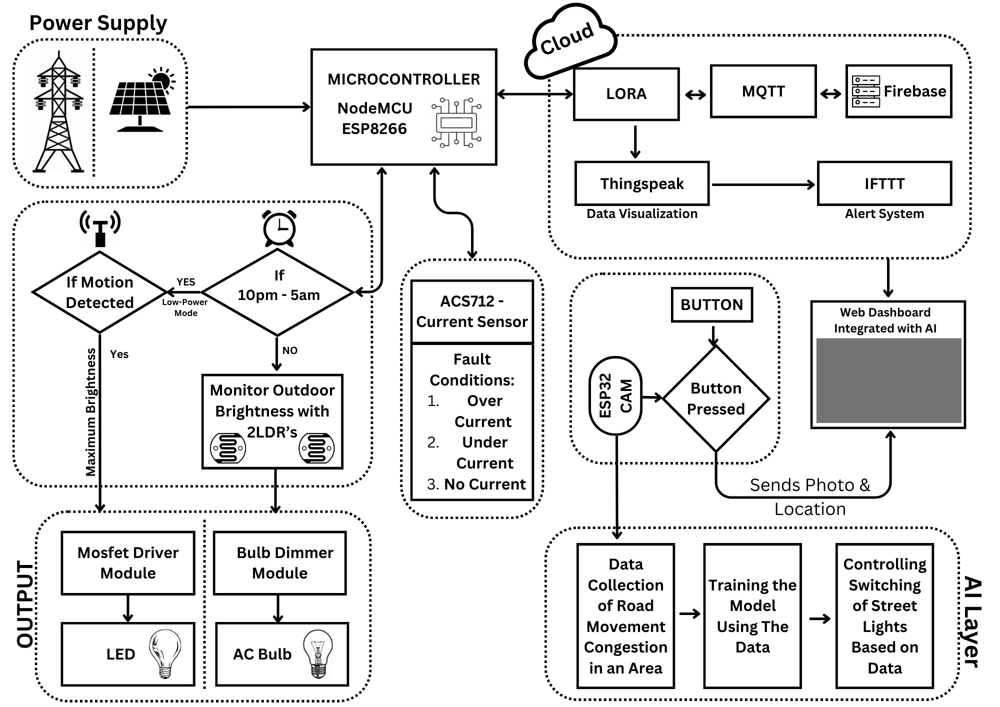

# Smart Street Lighting System using LoRaWAN, MQTT, and Edge AI

## 🌍 Project Overview

This project presents an **Interconnected Smart Street Lighting System** that optimizes energy usage and improves safety through intelligent automation and remote monitoring. It combines **LoRaWAN**, **MQTT**, and **Edge AI** technologies to achieve sustainable urban infrastructure in alignment with **UN SDG 7: Affordable and Clean Energy**.

---

## 🧠 Why This Project?

Traditional street lighting systems consume excessive energy and require manual fault detection. This smart system addresses:
- Energy efficiency using solar/grid hybrid power
- Real-time fault monitoring and anomaly detection
- Automated brightness control based on environmental lighting
- AI-driven dynamic control based on traffic density
- Quick emergency response with SOS functionality

---

## ⚙️ Key Features

- 🌞 **Hybrid Power Supply**: Solar + Grid-based power support for reliability and sustainability.
- 🔦 **Intelligent Brightness Control**:
  - Uses **Lux Sensor** to monitor ambient light.
  - Automatically dims lights during low-traffic hours (10 PM - 5 AM).
  - Motion-based activation using PIR sensors.
- 📶 **Wireless Communication**:
  - Uses **LoRaWAN** for long-range, low-power communication.
  - **MQTT + Firebase** for real-time cloud data updates.
- 🧠 **Edge AI Fault Detection**:
  - Luminance data analyzed using a **NanoEdge AI anomaly detection model**.
  - Automatically reports dim/faulty lights.
- 📊 **Visualization & Alerts**:
  - **ThingSpeak** for data visualization.
  - **IFTTT** for automatic SMS/email alerts with location.
- 🚨 **Emergency & Community Feedback**:
  - SOS button with ESP32-CAM sends image + location to dashboard.
  - QR-code based fault logging system for public participation.
- 🚗 **Road Safety Add-on**:
  - Red alert LEDs for sharp turns and accident-prone areas.

---

## 🧱 Tech Stack

- **Hardware**: NodeMCU ESP8266, ESP32-CAM, Lux Sensor, PIR Sensor, LoRa Module
- **Software**: Arduino IDE, NanoEdge AI Studio, Firebase, IFTTT, ThingSpeak
- **Protocols**: LoRaWAN, MQTT

---

## 📸 Flow Diagram

---

## 📄 Reference

This project is inspired and backed by research presented in:
> **"AI-Based Smart Streetlight System using LoRaWAN"**, Springer 2025. *(Include DOI or link if available)*

---

## 📬 Contributing

We welcome improvements and ideas! Feel free to fork the repo and raise a pull request.

---

## 🛠️ Authors

Developed by: *[Your Name or Team Name]*  
Affiliation: *[Your Institution or Organization]*

---

